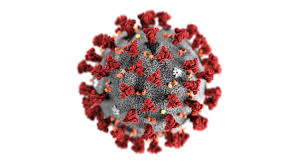

# Covid in California

Group: T-Th Group 3 - The Covid Killers

Selected Topic: COVID-19 Cases in California

Reason for selection: The spread of COVID-19 has changed society, nationally and internationally, and everyone is searching for answers. People are anxious about the all of the uncertainty accompanying the pandemic and  would be relieved by a crystal ball into the next few months.  Will the virus continue to spread or will it subside and be controlled?

Description of source data: Multiple sources of data will be transformed and combined to help us create future predictions for COVID cases

·    COVID-19 daily cases by State and County

·    California county demographics data; ethnicity, income, gender, and age 

Question Hoped to Answer: What do we see on the horizon for COVID-19 cases in each California County as we get towards the end of July?
