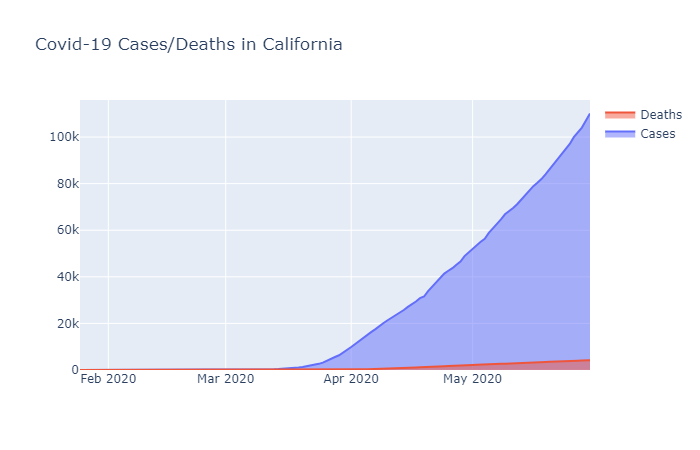
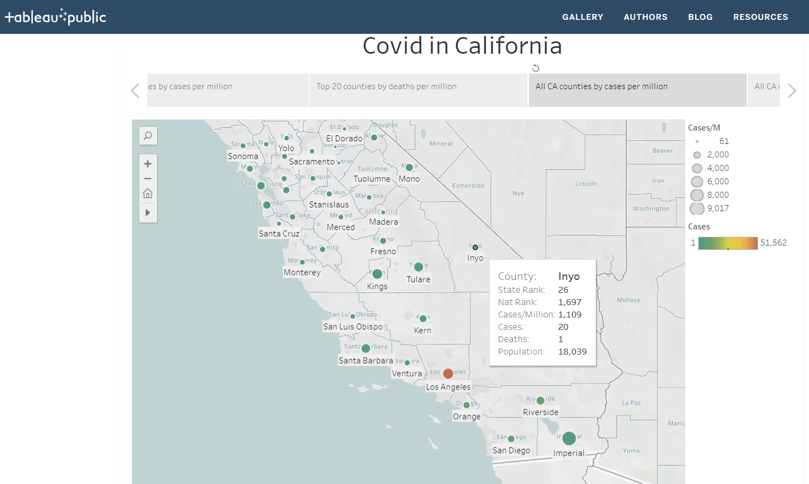

# Covid in California

<<<<<<< HEAD
Group: T-Th Group 3 - The Covid Killers

Selected Topic: COVID-19 Cases in California
=======
## Group: T-Th Group 3 - The COVID Killers

**Selected Topic: COVID-19 Cases in California**
>>>>>>> 9b095a0e5f6649462c2e5907ed64df3902efd4ee

Reason for selection: The spread of COVID-19 has changed society, nationally and internationally, and everyone is searching for answers. People are anxious about the all of the uncertainty accompanying the pandemic and  would be relieved by a crystal ball into the next few months.  Will the virus continue to spread or will it subside and be controlled?

Description of source data: Multiple sources of data will be transformed and combined to help us create future predictions for COVID cases

<<<<<<< HEAD
·    COVID-19 daily cases by State and County
=======
**COVID-19 daily cases by State and County**
>>>>>>> 9b095a0e5f6649462c2e5907ed64df3902efd4ee

·    California county demographics data; ethnicity, income, gender, and age 

<<<<<<< HEAD
Question Hoped to Answer: What do we see on the horizon for COVID-19 cases in each California County as we get towards the end of July?
=======
**Objective:** 
The COVID Killers team will predict an individual's likelihood of contracting the COVID-19 virus and the severity of the infliction based on a person's demographic profile.

**GitHub:** 
GitHub is the interface being used for team collaboration and shring progress on the project.  A project repository has been established at https://github.com/menlodoug/Final_Project/  with a master branch and at least 1 individual branch for each team member.

**Machine Learning Model:**
Pandas will be used to clean the data collected and perform exploratory analysis.  SciKitLearn is the Machine Learning library we'll be using to create a classifier, encode data, split data into test and train datasets, scale the data, and test various machine learning models for making future predictions.  Further analysis will be completed using Python.  A RandomForest machine learning model will be created to determine the probability of individuals contracting COVID-19, with data drawn from a PostGres database.

**Database:**
A PostGres database will hold the data used to predict the impact of COVID-19 on individuals.  We will integrate data from the database into our machine learning model.  Also, the data tables will be exported as csv files to use in Tableau to display the data in a dashboard/story.

**Dashboard/Story:**
Tableau will be used to display the data in a fully functioning interactive dashboard.  It will be hosted on on Tableau Public at https://public.tableau.com/profile/doug.smith8181#!/  Users may visit the Tableau dashboard to investigate their likelihood of contracting COVID-19 based on certain criteria, including: 1. county of residence, 2. age, 3. gender,  and 4. income level.  The very early stage of the Tableau story can be viewed at https://public.tableau.com/profile/doug.smith8181#!/vizhome/CovidinCalifornia_15909686590090/AllCACounties-CovidDeathsM-asof53020

**Presentation:**
A Google Slides presentation providing a comprehensive review of the COVD Killers project will be prepared, including:

* Selected topic
* Reason for topic selection
* Description of source(s) of data
* Questions to be answered with data
* Description of the data exploration phase of the project
* Description of the analysis phase
* Technologies, languages, tools, and algorithms used throughout the project
* Results of analysis
* Recommendations for future analysis
* Opportunities for improvement and proposed changes to the project approach

>>>>>>> 9b095a0e5f6649462c2e5907ed64df3902efd4ee
